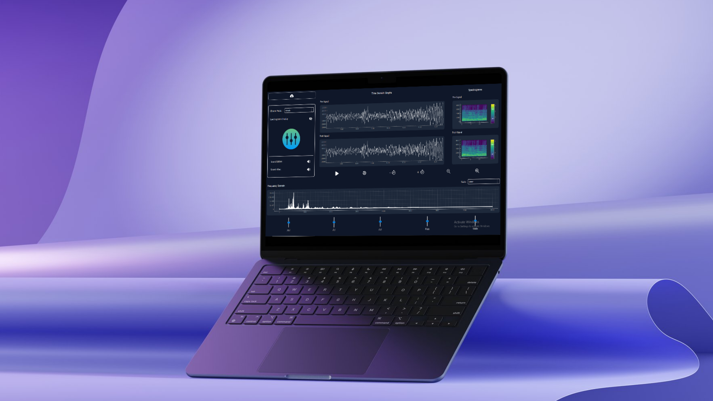
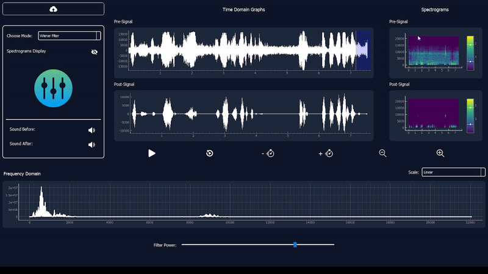
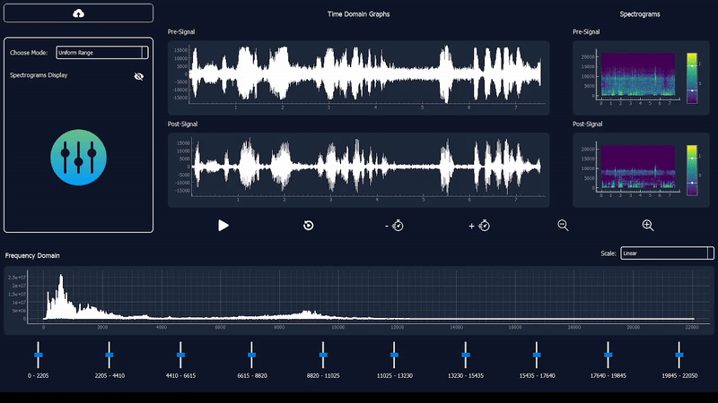
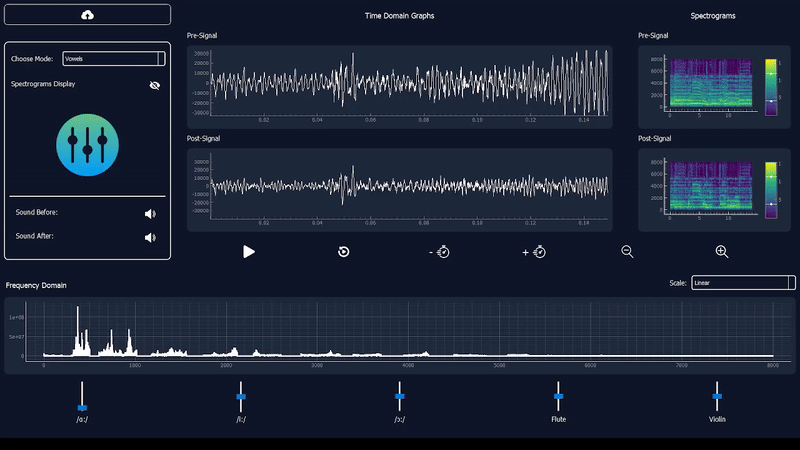
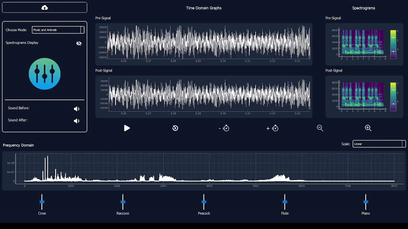

# Signal Equalizer Simulator



The **Signal Equalizer Simulator** is an interactive application designed for real-time audio signal processing. It provides users with a dynamic environment to adjust audio signals and visualize the impact of those adjustments across both time and frequency domains. The application supports mode-based audio signal adjustment for various scenarios.

## Features

### 1. Real-Time Audio Adjustment
- **Modes of Operation:**
  - **Wiener Filter-Based Noise Cancellation Mode:**  
  Users can select a specific region of the signal containing the noise profile and remove it from the audio signal. Additionally, users can control the strength of noise cancellation to fine-tune the output. The Wiener filter applies the formula:  
  $$\[
  H(f) = \frac{S_{xx}(f)}{S_{xx}(f) + S_{nn}(f)}
  \]$$
    - 
    - [Watch the video](assets/wiener_mode.mp4)  
  where $$\( S_{xx}(f) \)$$ is the power spectral density of the signal and $$\( S_{nn}(f) \)$$ is the power spectral density of the noise.
  - **Uniform Mode:**  
    Users have complete control over frequency bands to manually adjust signal equalization.
    - 
    - [Watch the video](assets/uniform_mode.mp4) 
  - **Vowel Mode:**  
    Equalizer settings are optimized for specific vowels (e.g., 'a', 'e', 'i', 'o', 'u'), enabling targeted audio signal modification.
    - 
    - [Watch the video](assets/vowels_mode.mp4) 
  - **Animals and Music Mode:**  
    Pre-defined settings for musical instruments like flute and violin and animals like raccon, tailored to enhance the specific characteristics of each instrument and animal.
    - 
    - [Watch the video](assets/animals_mode.mp4) 
- **Parameter Control:**
  - Intuitive sliders for controlling audio parameters.
  - Independent controls for specific frequency ranges and audio characteristics.

### 2. Interactive Visualizations
- **Time Domain Graphs:**
  - Compare pre-processed and post-processed signals side-by-side.
- **Frequency Domain Analysis:**
  - Monitor frequency spectrum changes in real time.
- **Spectrogram Display:**
  - Visualize time-frequency characteristics for both pre- and post-processed signals.

### 3. Audio Playback
- **Before and After Comparison:**
  - Playback original and equalized audio signals for real-time validation.
- **Control Options:**
  - Start, pause, reset, and zoom functionalities for signal visualization.

## Getting Started

### Prerequisites
Ensure you have the following installed:
- Python 3.x
- The dependencies listed in `requirements.txt`.

### Installation
1. Clone the repository:
   ```bash
   git clone https://github.com/yourusername/Signal-Equalizer-Simulator.git
   ```
2. Navigate to the project directory:
   ```bash
   cd Signal-Equalizer-Simulator
   ```
3. Install required dependencies:
   ```bash
   pip install -r requirements.txt
   ```

### Running the Application
To launch the simulator:
```bash
python main.py
```

## Usage

### Selecting Modes
1. Choose the desired mode from the **Mode Selector**:
   - **User Mode:** Adjust individual frequency bands manually.
   - **Vowel Mode:** Apply equalization presets for specific vowel sounds.
   - **Music Mode:** Enhance audio signals for instruments like flute and violin.
2. Adjust parameters using the sliders to observe changes in the audio signal.

### Visualizing Changes
- Use the **Time Domain Graphs** and **Frequency Domain Spectrum** to analyze signal modifications.
- Toggle the **Spectrogram Display** for a detailed frequency analysis.

### Audio Playback
- Compare the original and modified audio using the **Sound Before** and **Sound After** buttons.

## Dependencies

| **Dependency**       | **Description**                                       |
|-----------------------|-------------------------------------------------------|
| Python 3.x           | Core programming language.                            |
| NumPy                | For numerical computations and signal processing.     |
| SciPy                | Advanced scientific computing and signal operations.  |
| PyQt5                | GUI framework for desktop application development.    |
| PyQtGraph            | Fast and interactive 2D/3D plotting.                  |
| Matplotlib           | Visualization library for frequency spectrum analysis.|


## Contributors <a name="Contributors"></a>
<table>
  <tr>
    <td align="center">
      <a href="https://github.com/Mostafaali3" target="_blank">
        
        <br />
        <sub><b>Mostafa Ali</b></sub>
      </a>
    </td>
    <td align="center">
      <a href="https://github.com/Youssef-Abo-El-Ela" target="_blank">
        
        <br />
        <sub><b>Youssef Abo El-Ela</b></sub>
      </a>
    </td>
    <td align="center">
      <a href="https://github.com/karreemm" target="_blank">
        
        <br />
        <sub><b>Kareem Abdel Nabi</b></sub>
      </a>
    </td>
    <td align="center">
      <a href="https://github.com/AhmedXAlDeeb" target="_blank">
        
        <br />
        <sub><b>Ahmed AlDeeb</b></sub>
      </a>
    </td>
  </tr>
</table

Thank you for using the Signal Equalizer Simulator! If you encounter any issues, feel free to open an issue on GitHub.

